# Diagrama de Herencia

```mermaid
classDiagram
    direction LR

    %% Base trait
    class BaseContainerTrait

    %% Base node
    class BaseNode

    %% Base iterator
    class general_iterator

    %% Nodes
    class LLNode
    class DLLNode
    class HeapNode
    class VectorNode

    BaseNode <|-- LLNode
    BaseNode <|-- HeapNode
    BaseNode <|-- VectorNode
    LLNode <|-- DLLNode

    %% Linked list traits
    class BaseLinkedListTrait
    class AscendingLinkedListTrait
    class DescendingLinkedListTrait

    BaseContainerTrait <|-- BaseLinkedListTrait
    BaseLinkedListTrait <|-- AscendingLinkedListTrait
    BaseLinkedListTrait <|-- DescendingLinkedListTrait

    %% Double linked list traits
    class BaseDoubleLinkedListTrait
    class AscendingDoubleLinkedListTrait
    class DescendingDoubleLinkedListTrait

    BaseContainerTrait <|-- BaseDoubleLinkedListTrait
    BaseDoubleLinkedListTrait <|-- AscendingDoubleLinkedListTrait
    BaseDoubleLinkedListTrait <|-- DescendingDoubleLinkedListTrait

    %% Circular linked list traits
    class BaseCircularLinkedListTrait
    class AscendingCircularLinkedListTrait
    class DescendingCircularLinkedListTrait

    BaseContainerTrait <|-- BaseCircularLinkedListTrait
    BaseCircularLinkedListTrait <|-- AscendingCircularLinkedListTrait
    BaseCircularLinkedListTrait <|-- DescendingCircularLinkedListTrait

    %% Circular double linked list traits
    class BaseCircularDoubleLinkedListTrait
    class AscendingCircularDoubleLinkedListTrait
    class DescendingCircularDoubleLinkedListTrait

    BaseContainerTrait <|-- BaseCircularDoubleLinkedListTrait
    BaseCircularDoubleLinkedListTrait <|-- AscendingCircularDoubleLinkedListTrait
    BaseCircularDoubleLinkedListTrait <|-- DescendingCircularDoubleLinkedListTrait

    %% List containers
    class LinkedList
    class DoubleLinkedList
    class CircularLinkedList
    class CircularDoubleLinkedList

    LinkedList <|-- DoubleLinkedList
    LinkedList <|-- CircularLinkedList
    DoubleLinkedList <|-- CircularDoubleLinkedList

    %% Linked-list iterators
    class LinkedListForwardIterator
    class DoubleLinkedListBackwardIterator
    class CircularLinkedListForwardIterator
    class CircularDoubleLinkedListForwardIterator
    class CircularDoubleLinkedListBackwardIterator

    general_iterator <|-- LinkedListForwardIterator
    general_iterator <|-- DoubleLinkedListBackwardIterator
    general_iterator <|-- CircularLinkedListForwardIterator
    general_iterator <|-- CircularDoubleLinkedListForwardIterator
    general_iterator <|-- CircularDoubleLinkedListBackwardIterator

    %% Vector side
    class VectorTraits
    class Vector
    class vector_forward_iterator
    class vector_backward_iterator

    BaseContainerTrait <|-- VectorTraits
    general_iterator <|-- vector_forward_iterator
    general_iterator <|-- vector_backward_iterator

    %% Heap side
    class BaseHeapTrait
    class AscendingHeapTrait
    class DescendingHeapTrait
    class Heap

    BaseContainerTrait <|-- BaseHeapTrait
    BaseHeapTrait <|-- AscendingHeapTrait
    BaseHeapTrait <|-- DescendingHeapTrait

    %% Binary tree side
    class BaseBinaryTreeListTrait
    class DescendingBinaryTreeListTrait
    class BinaryTree
    class BinaryTreeNode
    class BinaryTreeForwardInorderIterator
    class BinaryTreeBackwardInorderIterator
    class BinaryTreeForwardPreorderIterator
    class BinaryTreeBackwardPreorderIterator
    class BinaryTreeForwardPostorderIterator
    class BinaryTreeBackwardPostorderIterator

    BaseNode <|-- BinaryTreeNode
    BinaryTree *-- BinaryTreeNode
    BinaryTree ..> BaseBinaryTreeListTrait : usa Traits
    BinaryTree ..> DescendingBinaryTreeListTrait : usa Traits

    general_iterator <|-- BinaryTreeForwardInorderIterator
    general_iterator <|-- BinaryTreeBackwardInorderIterator
    general_iterator <|-- BinaryTreeForwardPreorderIterator
    general_iterator <|-- BinaryTreeBackwardPreorderIterator
    general_iterator <|-- BinaryTreeForwardPostorderIterator
    general_iterator <|-- BinaryTreeBackwardPostorderIterator
```

## Nota

El diagrama representa relaciones de herencia por clase y struct en los headers del proyecto.
Para BinaryTree, tambien se muestra composicion (nodo anidado) y dependencia por Traits.
